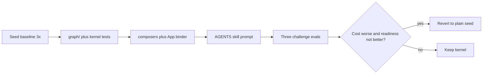

# Graph kernel coding pass

Source of truth: [docs/implementation.md](docs/implementation.md). This plan does not restate schema, paper mapping, or the book JSON. Code against that file.

Do not edit anything under [`src/`](src/) (runner, `prepare-output.ts`, verify). Do not add npm packages. Do not hard-block writes to `src/graph/` in [`solution/extensions/protected-paths.ts`](solution/extensions/protected-paths.ts).

## 1. Baseline (before any kernel code)

Unmodified 13-line [`app-template/src/App.tsx`](app-template/src/App.tsx). Spec: [Baseline first](docs/implementation.md#baseline-first--before-the-coding-pass).

- 3 × `npm run challenge` on [`contract-public/development-idea.txt`](contract-public/development-idea.txt). Each run overwrites `output/app/`; copy each `result.json` to `docs/personal/baseline/` (gitignored).
- Record median `cost_total`, `total_tokens`, `model_calls`, `status`, and the three `harness_checks`.
- Needs Node 22.19.x and provider creds (`CHALLENGE_THINKING=off`). `--prepare-only` is not a baseline.

## 2. Kernel

Implement [Runtime kernel](docs/implementation.md#runtime-kernel) under `app-template/src/graph/` exactly as sketched (`types.ts`, `load-model.ts`, `store.ts`, `persist.ts`, `GraphProvider.tsx` + `*.kernel.test.ts`).

- Domain-neutral identifiers only. `graph/` excluding tests ≤ 300 lines.
- Stale `undo` is a no-op. Duplicate unique attrs return `{ ok: false }`, not a fake undo.
- Persist key `agent-cofounder-graph`. Malformed / quota → `persistError`, never throw through render.
- Vitest split: exclude `**/*.kernel.test.ts` from [`app-template/vitest.config.ts`](app-template/vitest.config.ts); add `vitest.kernel.config.ts` (`environment: "jsdom"`). Root [`package.json`](package.json): add `app:test:kernel` and run it from `check`. `app:test` keeps `--passWithNoTests`.
- Empty default [`src/product-model.json`](app-template/src/product-model.json) so `--prepare-only` and `npm run build` stay green.

## 3. Composers and binder

[Composers](docs/implementation.md#composers) plus rewrite [`app-template/src/App.tsx`](app-template/src/App.tsx) as binder. Each composer ≤ 120 lines.

- Labels from the model (`Add book`, never `Create node`).
- One undo on delete in `Collection` (`role="status"`). No undo history.
- Empty / invalid model: shell only, still starts on `:3000`.
- Shared filter state in the binder, not a second store.
- [`app-template/src/main.tsx`](app-template/src/main.tsx) unchanged.

## 4. Agent pipeline

[Later edits](docs/implementation.md#later-edits-coding-pass). All three texts plus the skill must agree. No paper theory in the prompt.

- [`app-template/AGENTS.md`](app-template/AGENTS.md): replace “the seed intentionally contains no product tests”; add model-first / escape-hatch / do-not-rewrite-`src/graph/` lines.
- [`solution/skills/mvp-builder/SKILL.md`](solution/skills/mvp-builder/SKILL.md): **add** the nine merged steps; keep readiness steps 3–5 and 7; do not replace wholesale.
- [`solution/system-prompt.md`](solution/system-prompt.md): shorter, same product constraints.
- Skill read budget: `types.ts`, `product-model.json`, `App.tsx`, composer **prop types** only.

## 5. Eval and abort

[After the coding pass](docs/implementation.md#after-the-coding-pass). Local idea files only; do not edit `contract-public/`.

1. Book-lending placeholder.
2. Another record-keeping idea (e.g. pantry).
3. Escape-hatch idea (e.g. timer) — required.

Success: `status: success`, both `result.json` destinations, harness checks green, `tests_run` names user journeys, median `cost_total` at or below baseline. Audit: `diff -r app-template/src/graph output/app/src/graph` and count non-kernel test files.

**Abort:** if median `cost_total` is higher than baseline *and* harness checks plus journey coverage are not better, revert to the plain seed.

## Out of scope (this plan)

Everything in [Out of scope](docs/implementation.md#out-of-scope), plus v2 harness composition and the optional second Pi step.
