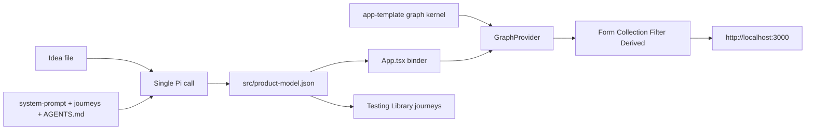

# Graph-composed MVP harness

Spec for a later coding pass. No kernel, prompt, or runner changes land until that pass.

Two layers, both domain-neutral:

- **Compile-time ProductGraph** — Pi extracts the idea into a JSON model (entities, attributes, journeys, derived values, assumptions).
- **Runtime graph** — a tiny in-browser store plus composers. Idea vocabulary is data on the model. The UI is a normal product, not a graph explorer.

Inspired by [*A Programming Paradigm for Spatiotemporal Composability*](spatiotemporal-composability.pdf) (Shi, Zhang, Cui) without porting Cordis. That paper is a preprint under active revision; this design borrows its vocabulary, not its results. [Paper mapping](#paper-mapping) states what the harness actually earns.

## Goal and judging fit

Official judging uses a **hidden idea** and private browser journeys. The committed book-lending prompt in [`contract-public/development-idea.txt`](../contract-public/development-idea.txt) is a development placeholder only. Ranked evaluation is **GLM-5.2 on Berget**; ranking uses **Pi’s reported runtime cost**. Application Readiness (~100 points) is separate and not yet weighted against efficiency.

| Axis | How this design helps | How it can fail |
| --- | --- | --- |
| **Readiness** | Composers render forms, lists, filters, counts with semantic HTML and names taken from the model | Shipping a node/edge explorer, or forcing a fake graph onto a non-record product |
| **Efficiency** | Kernel and composers ship in [`app-template/`](../app-template/) so Pi writes a model and bindings, not an architecture. [Measured](#baseline-first--before-the-coding-pass), single-variable comparison: graph-seed median €0.0535 / harness green vs plain-seed median €0.0818 / three timeouts | A large kernel that Pi reads end-to-end; long prompts that dump paper theory |
| **Hidden idea** | Reusable APIs use only generic types (`EntityType`, `LinkType`, `JourneyKind`) | Book/lending words in kernel, composers, or skills |
| **Audit** | [`src/run-challenge.ts`](../src/run-challenge.ts) still writes both `result.json` files; the model never writes telemetry | Changing `result.json` ownership, skipping harness checks, or [padding the app’s test run with seed tests](#tests) so `numTotalTests > 0` no longer proves Pi wrote one |

Constraints that stay fixed in v1:

- One Pi call. The runner still owns both `result.json` files. It records `stop_reason` / `truncated` from Pi’s event stream and skips app verification when the **final** assistant message was truncated. It does not change `composeResult` status rules. The appended system prompt remains a cacheable GLM-5.2 prefix.
- `CHALLENGE_THINKING` stays `off` unless a later measurement shows reasoning pays for itself.
- One seed dependency, [`@picocss/pico`](#composers) (classless CSS, pinned `2.1.1`), and no others without the same justification. No backend or external API; see [`storage.md`](storage.md).
- Node 22.19.x, Pi `@earendil-works/pi-coding-agent@0.84.1`.

## Architecture



- **Compile-time graph:** `src/product-model.json` is the plan the rest of the run executes.
- **Runtime store:** one in-memory graph, one persistence key per product, one React context (`GraphProvider`). Composers do not own stores.
- **v1 runner:** prepares `output/app/` from `app-template/`, appends [`solution/system-prompt.md`](../solution/system-prompt.md) + [`contract-public/journeys.md`](../contract-public/journeys.md) + `output/app/AGENTS.md` (the copy of [`app-template/AGENTS.md`](../app-template/AGENTS.md) made by `prepareOutput`), and loads [`solution/skills/mvp-builder`](../solution/skills/mvp-builder/SKILL.md) plus [`solution/extensions/protected-paths.ts`](../solution/extensions/protected-paths.ts). The usage collector also copies `message.stopReason` onto `call_log` and sets `truncated` when an assistant call hit `length`. That is the only runner carve-out.

### Proposed file tree (later coding pass)

```
app-template/
  vitest.config.ts           # excludes **/*.kernel.test.ts
  vitest.kernel.config.ts    # includes only **/*.kernel.test.ts
  src/
    graph/
      types.ts               # ProductModel + store types
      load-model.ts          # JSON → ProductModel | InvalidModel
      store.ts               # apply / undo / query / version counter
      persist.ts             # localStorage key + malformed payload
      GraphProvider.tsx      # one context, one store, useSyncExternalStore hooks
      store.kernel.test.ts   # domain-neutral kernel tests
      persist.kernel.test.ts
      load-model.kernel.test.ts
    composers/
      AppShell.tsx
      RecordForm.tsx
      Collection.tsx
      FilterBar.tsx
      DerivedStat.tsx
    product-model.json       # valid empty default; Pi replaces
    App.tsx                  # binder
    main.tsx                 # unchanged entry
```

Pi’s writable surface after copy: `src/product-model.json`, optional binder tweaks in `App.tsx`, product tests under `src/**/*.test.tsx`, and `report.partial.json`. Pi should not rewrite kernel internals.

That boundary is **prompt-enforced only**. [`solution/extensions/protected-paths.ts`](../solution/extensions/protected-paths.ts) blocks writes outside the app root and to `.git`, `node_modules`, `result.json`, and `.env*` — nothing stops Pi editing `src/graph/`. Do not add a hard block: it would trap Pi in a repair loop and contradicts the [escape hatch](#escape-hatch), which explicitly allows abandoning the kernel. Measure adherence instead (see [Later eval](#later-eval-and-follow-ups)).

## ProductGraph schema

[`contract-public/journeys.md`](../contract-public/journeys.md) is a **coverage check**, not a feature shopping list. Implement a pattern only when the idea details or implies it. Omit the rest and record why in `assumptions`.

### Types (`src/graph/types.ts`)

```ts
export type AttributeKind = "text" | "textarea" | "choice" | "number" | "boolean" | "date";

export interface AttributeType {
  id: string;
  label: string;
  kind: AttributeKind;
  required: boolean;
  unique?: boolean;
  choices?: string[];
}

export interface EntityType {
  id: string;
  singular: string;
  plural: string;
  attributes: AttributeType[];
}

export interface LinkType {
  id: string;
  label: string;
  from: string;
  to: string;
  optional: boolean;
}

export type JourneyKind = "add" | "edit" | "delete" | "filter" | "derive" | "persist";

export interface Journey {
  kind: JourneyKind;
  /** User-visible sentence for tests_run[].journey */
  journey: string;
}

export type DerivedKind = "count-nodes" | "count-nodes-where" | "sum-number";

export interface DerivedQuery {
  id: string;
  label: string;
  kind: DerivedKind;
  entity: string;
  /** Attribute id summed by sum-number */
  attribute?: string;
  /** Attribute id on the entity; used by count-nodes-where */
  where?: { attribute: string; present?: boolean; equals?: string };
}

export interface ProductModel {
  title: string;
  entities: EntityType[];
  links: LinkType[];
  journeys: Journey[];
  derived: DerivedQuery[];
  assumptions: string[];
}
```

Attribute-kind notes:

- All attribute values are stored as strings. `boolean` stores `"true"` or `""`, so `where.present` reads it without a second predicate. `date` stores `YYYY-MM-DD`, which sorts and compares as text.
- `boolean` and `date` exist because record-keeping ideas outside the book placeholder usually need a done-checkbox or a due date (task lists, bookings, habits, subscriptions). Forcing those into a `choice` of `["Yes", "No"]` costs readiness with a browser judge for no saving.
- `sum-number` covers the “total spent / total value / hours this week” family, which is as common in this idea space as a count.

`count-links` is deliberately absent from `DerivedKind`. See [Links may be dead weight](#links-may-be-dead-weight).

Empty default `src/product-model.json`:

```json
{
  "title": "",
  "entities": [],
  "links": [],
  "journeys": [],
  "derived": [],
  "assumptions": []
}
```

Runtime graph instance (not written by Pi; owned by the store):

```ts
export interface NodeRecord {
  id: string;
  type: string;
  attributes: Record<string, string>;
}

export interface EdgeRecord {
  id: string;
  type: string;
  from: string;
  to: string;
}

export interface GraphSnapshot {
  nodes: NodeRecord[];
  edges: EdgeRecord[];
}
```

## Decisions

### Model format: JSON + typed loader

**Pick: `src/product-model.json` plus `loadProductModel(raw: unknown)`.**

Vite can import a committed valid JSON file so `npm run build` and `--prepare-only` stay green. The loader validates *shape* and *references* at runtime: every `derived.entity` must name an entity, `derived.attribute` / `derived.where.attribute` must name an attribute on that entity, `sum-number` must point at a `number` attribute, and `count-nodes-where` must have `where`. Broken refs are the invalid-model shell, not a silent `0` from `store.derive`. `links[].from` / `links[].to` are not checked — there is no composer path for links. No config change is needed: [`app-template/tsconfig.json`](../app-template/tsconfig.json) already sets `resolveJsonModule: true`.

| Failure | Outcome |
| --- | --- |
| Invalid JSON syntax | `tsc` / Vite build fails; Pi repairs the file |
| Valid JSON, wrong shape or broken derived refs | App still builds and starts; binder shows the invalid-model state |
| Valid TS object, wrong types | Would fail `tsc` and is harder for Pi to repair than JSON |

**The reference checks are unexercised.** No Pi run has produced a model that fails them. The four attempts against the seed that carries these checks (pantry ×2, timer ×2) all truncated before writing anything; the two earlier runs predate the checks. Two properties of the loader matter more than the checks until one does fire:

- The **empty seed passes.** `title: ""` is a valid string and empty arrays satisfy every reference check, so `loadProductModel` returns `ok` on an untouched `product-model.json`. A run that wrote a good model and a run that never wrote at all are indistinguishable here; `truncated` separates them, not the loader.
- A rejection is **silent about why.** `{ ok: false }` carries no reason and no field name, so Pi has to read `load-model.ts` and bisect its own model. That is the repair-loop shape that cost book-1 and book-2 their runs, on a path nothing has walked yet.

Rejected: `product-model.ts` as the Pi artifact. Type errors and import syntax waste repair tokens.

### Links vs attributes

**A second entity exists only if the idea treats that thing as its own record** — something the user independently adds, edits, lists, or deletes.

- A scribbled name, tag, or status on the primary record is an **attribute**.
- A **link** connects two entity types that both appear as records in the idea.
- Do not invent a `Person` (or similar) node so a name can be an edge.

The book-lending placeholder notes a borrower’s name and clears it on return. That is an optional text attribute, not a Person entity. See [Worked example](#worked-example-book-lending-placeholder).

### Links may be dead weight

The rule above is correct and strict — strict enough that most single-user MVP ideas will produce `links: []`, as the worked example does. That leaves the kernel carrying `EdgeRecord`, two edge ops, the incident-edge cascade, and `edges(type)` with no real journey exercising any of it, all charged against the [size budget](#size-budget).

v1 keeps `EdgeRecord` and the two edge ops. The delete cascade is the one genuine demonstration of revertible effects, and it is cheap. `count-links` is dropped from `DerivedKind` because a count over an empty edge set is not a derived value any product will ask for.

**Decision (fired, 30 August 2026).** All four GLM ideas produced `links: []` — committed book-lending, pantry, timer (empty seed, hatch taken), and the normalized book restatement. There is still no composer and no binder path for a link, so empty is not evidence the model declined a graph; it is evidence there was nowhere to put one. Do not pitch a product-layer graph. This is a model-driven record store. The graph claim lives in memory (`GraphStore`) and in the harness (`buildPiArguments` / `protected-paths`), where [`core-concept.md`](personal/core-concept.md) already puts it. Kernel edge types stay; do not build a binder path for links. The [paper mapping](#paper-mapping) is rewritten to match.

### Revertible effects: one undo, not a history

`apply(op)` returns an `undo` function. Specified first as purely internal — “composer teardown, replacing an edit, clearing a field” — it then had no caller anywhere in this document. Those are all *forward* ops: an edit is an `upsert-node`, clearing a field is an `upsert-node` with `""`. [Persist](#persist-persistts) declines the one remaining candidate, keeping a write in memory rather than reverting it when the save fails. An inverse nothing invokes is lines charged against the [size budget](#size-budget) to support a claim in the [paper mapping](#paper-mapping).

v1 gives it exactly one call site: **a single undo on destructive delete.**

- `Collection`’s delete row action applies `delete-node` and holds the returned `undo` in local component state.
- It renders `Removed {singular}` and an **Undo** button in a `role="status"` live region, so the affordance is announced and not merely visible. Wording comes from the model — “Removed book”, never “Removed node”.
- The held `undo` is discarded on the next store version change. That one line is what keeps the inverse sound; see [Store](#store-storets).
- No new `JourneyKind`. This rides on `delete`. A product test may assert it; the skill must not require one.

This is a product affordance for accidental data loss — something a browser judge is likely to try — and it is the only place a user meets the kernel’s central mechanism. It is not an undo stack. Still out of scope: undo **history**, multi-step undo, redo, and undo on non-destructive actions, none of it unless the idea implies history.

### Empty or invalid model

The app must still start at `http://localhost:3000` and pass `npm run build`.

- **Empty model** (`entities.length === 0`, valid JSON): `AppShell` with the model `title` if any, otherwise a short ready-state. No graph jargon. Copy stays product-neutral, e.g. “Ready to build.” This is the seed / `--prepare-only` path.
- **Invalid model** (wrong shape, or a derived query that fails the [reference checks](#model-format-json--typed-loader)): same shell plus a recoverable message that the product definition could not be read. Do not crash the tree.
- Official challenge runs must not stay on these states; Pi writes a real model or takes the [escape hatch](#escape-hatch). **Six Qwen runs have anyway** (pantry ×3, timer ×3), every one a `stop_reason: length` dump before the first write. They land on the *empty* state, which is valid — the loader returns `ok` — so nothing in the app can detect it. `truncated` and the `harness_checks[].journey` prefix are what report it.

### Escape hatch

The five public journeys describe **record-keeping** patterns. The hidden idea may not.

If the idea is not a collection of records (quiz, timer, calculator, multi-step wizard, canvas, etc.):

1. Do **not** invent entities to satisfy the kernel.
2. Leave or ignore `product-model.json`.
3. Replace `App.tsx` with a purpose-built UI.
4. Keep the kernel on disk; unused code is fine.
5. Record the choice in `assumptions`.
6. Add Testing Library tests for the journeys the idea actually implies.

The skill must say this in those words. Forcing a fake graph will lose readiness.

What “unused code is fine” costs, stated so the coding pass does not rediscover it:

- `npm run build` runs `tsc --noEmit` with `include: ["src", ...]`, so an abandoned kernel is still typechecked. Unused kernel code must compile on its own — no unresolved imports, no reliance on a binder that no longer exists.
- The empty default `product-model.json` still imports and parses cleanly, so an untouched model file never breaks the build.
- Kernel tests do **not** pad the app’s test run, because they are excluded (see [Tests](#tests)). Without that exclusion, a timer app with zero product tests would pass every harness check on the strength of the seed’s own tests — the escape hatch is the case where that failure is most likely and least visible.

**The hatch has been taken** (timer-3a: 9/9 tests and a green build, killed before `report.partial.json`; timer-5: replaced `App.tsx`, empty model, kernel on disk, died in test repair). Pi did not invent timer entities. The two claims this section exists to protect — that an abandoned kernel still typechecks, and that the test exclusion stops the seed’s own tests from carrying an app with none of its own — still have no *harness-finished* timer behind them.

This is also the one place the design earns the paper’s withdrawal guarantee outright: the kernel is a component that can be removed whole, leaving a system that still builds and runs as though it had never been there. It holds at the file level, across a build — which is why the [mapping](#paper-mapping) keeps it separate from runtime temporal composability.

## Runtime kernel

No-dep module under `app-template/src/graph/`. Domain-neutral identifiers only.

### Store (`store.ts`)

```ts
type Op =
  | { kind: "upsert-node"; node: NodeRecord }
  | { kind: "delete-node"; id: string }
  | { kind: "upsert-edge"; edge: EdgeRecord }
  | { kind: "delete-edge"; id: string };

type Undo = () => void;

type ApplyResult =
  | { ok: true; undo: Undo }
  | { ok: false; reason: "duplicate"; attribute: string };

interface GraphStore {
  getState(): GraphSnapshot;
  /** Increments on every accepted apply/undo; the subscription identity */
  getVersion(): number;
  apply(op: Op): ApplyResult;
  query: {
    nodes(type: string): NodeRecord[];
    nodesWhere(type: string, pred: (node: NodeRecord) => boolean): NodeRecord[];
    edges(type: string): EdgeRecord[];
    derive(query: DerivedQuery): number;
  };
}
```

- Stable ids: generate in `apply` if missing (`crypto.randomUUID` when available; sequential fallback in tests).
- `delete-node` also removes incident edges (the inverse restores node + those edges).
- **An `undo` is valid only until the next accepted op.** The inverse restores the node’s previous record wholesale, so calling it after an unrelated edit to that node would silently revert the edit too — the paper’s independence-of-effects requirement, which a bare closure does not impose. The store enforces it rather than asking callers to: `apply` stamps the current version into the closure, and an `undo` whose stamp is stale is a no-op. Callers therefore hold an inverse across no other mutation, which is exactly what the [delete affordance](#revertible-effects-one-undo-not-a-history) does. Two lines, and it removes the whole class of bug.
- Duplicate `unique` attributes: `apply` returns `{ ok: false, reason: "duplicate", attribute }` and changes nothing. `apply` must **not** return a bare `Undo` — a caller cannot tell a no-op undo from a real one, so the rejection has to be in the return type. `RecordForm` renders the message beside the offending field with `aria-invalid` and `aria-describedby`.

### Persist (`persist.ts`)

- Key: `agent-cofounder-graph:<slug(title)>`; empty title ⇒ `agent-cofounder-graph`. Per-title keys accumulate one orphaned key per idea in a browser profile; nothing prunes them. Accepted because MVP payloads are kilobytes against a ~5 MB origin quota.
- Payload: `{ version: 1, snapshot: GraphSnapshot }`.
- On load: missing key → empty snapshot. Malformed JSON, wrong version, or non-array `nodes`/`edges` → empty snapshot and a store-level flag `persistError` so the shell can show a recoverable message. Never throw through React render.
- Save after every accepted `apply` / `undo`. Quota or `SecurityError`: set `persistError`, keep working in memory.
- **Model drift.** Pi edits `product-model.json` during the run while storage may already hold nodes from the earlier shape. On load, drop nodes whose `type` is not an entity in the current model, drop edges whose endpoints are gone, and treat any missing attribute key as `""`. Silent tolerance here, not an error state — the user never caused it.

### Subscription (`GraphProvider.tsx`)

The store keeps one monotonic version counter. `GraphProvider` exposes hooks built on React 19’s `useSyncExternalStore`:

```ts
function useNodes(type: string): NodeRecord[];
function useDerived(id: string): number;
function usePersistError(): string | undefined;
```

Each hook subscribes to the single version counter and memoizes its slice by `[version, ...args]`, so it recomputes only when the store actually changed and unsubscribes on unmount (temporal safety for composers).

There is no `subscribe.ts` and no `SliceSpec` union. Per-slice change detection was specified first and cut: `useSyncExternalStore` over one counter is roughly twenty lines against a hundred, it needs no kernel tests of its own, and the re-render it would avoid does not exist in an app holding tens of records. The [size budget](#size-budget) is the binding constraint, and this is the cheapest place to meet it.

### Size budget

The 302-line `graph/` ceiling was pointed at the wrong files. Book-3 (Qwen, after `setup.ts` isolation; `docs/personal/eval/book-result-3.json`) opened every graph module and every composer, and did not open kernel tests. The efficiency risk is the surface Pi actually reads. The old ceiling’s rationale is unchanged; only its target moves.

Book-3 `read` tool, product source:

| Surface | Lines then | Opened |
| --- | --- | --- |
| `graph/types.ts` | 57 | yes |
| `graph/load-model.ts` | 55 | yes |
| `graph/store.ts` | 104 | yes |
| `graph/persist.ts` | 41 | yes |
| `graph/GraphProvider.tsx` | 45 | yes |
| `composers/` (six files) | 320 | yes, wholesale |
| `App.tsx` | 72 | yes |
| `test/setup.ts` | 8 | yes |
| `main.tsx` | 13 | yes |
| `graph/*.kernel.test.ts` | 206 | no |

After derived reference checks, `graph/` is 321 lines and the opened seed is **757**.

**The ceiling was re-derived on GLM, 31 August 2026, and raised from 734 to 780.** The old number came from Qwen, where wholesale seed reads competed with the 16,384-token output cap inside one run — pantry-2 read every composer and the kernel, spent a whole 16k message reasoning, and wrote nothing. That pressure does not exist on the ranked model. The [baseline](#baseline-first--before-the-coding-pass) settled it: GLM absorbs the seed reads through prefix and conversation cache, and the graph seed finishes 35% cheaper than a 13-line seed *and* is the only arm that completes at all. The budget is still real — every line is read on some run — but it is now sized against GLM's demonstrated behaviour rather than Qwen's failure mode.

| Budget | Limit |
| --- | --- |
| Opened seed (`graph/` + `composers/` + `App.tsx` + `setup.ts` + `main.tsx`) | ≤ 780 lines (**757** today) |
| Each composer | ≤ 135 lines (`RecordForm` is 132 with validation) |
| Documented, not read: [`test/journeys.tsx`](../app-template/src/test/journeys.tsx) | 106 lines, its API restated in `SKILL.md` step 6 so Pi uses it without opening it |
| Off-budget: `styles.css`, Pico | Not read by Pi and not part of the opened surface |
| Skill instructions for file reads | Read `types.ts`, `product-model.json`, `App.tsx`, and composer **prop types** only. Do not open `store.ts` / `persist.ts` / `GraphProvider.tsx` unless a kernel test fails. Book-3 ignored this. |

If the opened seed grows past 780, delete features; do not add a query language. The per-composer limit moved 120 → 135 once, for the [validation](#composers) that a GLM run wrote into `RecordForm` itself and that was then lost. Neither number gets waived a second time without a fresh measurement.

[`app-template/src/test/setup.ts`](../app-template/src/test/setup.ts) must `cleanup()` and `localStorage.clear()` in `afterEach`. Testing Library 16.3.0 registers auto-cleanup only when `afterEach` is a global; this seed does not set `globals: true`. Without the explicit cleanup, every `render(<App />)` stacks another app and inherits persisted records — that is what killed book-2.

### Tests

| Suite | Where | Runs in the generated app? | Purpose |
| --- | --- | --- | --- |
| Kernel | `src/graph/*.kernel.test.ts` | **No** — excluded | apply/undo, persist malformed payload, loader shape and derived-ref checks against an **inline** empty model (do not import the live `product-model.json`) |
| Product journeys | `src/**/*.test.tsx` added by Pi | Yes | Testing Library: user-visible add/edit/delete/filter/derive/persist |

**Kernel tests must not run inside the generated app.** [`verifyGeneratedApp`](../src/verify-app.ts) runs the app’s Vitest with `--passWithNoTests=false` and requires `numTotalTests > 0` with nothing failed, skipped, or todo. That check is meaningful today *only because the seed ships zero tests* — it is the harness’s one independent piece of evidence that Pi authored a real test. The `tests_run` journeys in `report.partial.json` are self-reported prose; [`composeResult`](../src/result.ts) requires them non-empty and passing but never compares them to files on disk.

Ship passing kernel tests into `output/app/` and a run where Pi writes **no** product tests passes all three `harness_checks`, leaving the model’s own honesty as the only gate. Instructing the skill to name real journeys does not restore the check.

Mechanism (coding pass):

- Name kernel tests `*.kernel.test.ts`.
- [`app-template/vitest.config.ts`](../app-template/vitest.config.ts) gains `exclude: [...configDefaults.exclude, "**/*.kernel.test.ts"]` (import `configDefaults` from `vitest/config`).
- New `app-template/vitest.kernel.config.ts` includes **only** `src/**/*.kernel.test.ts`, and must keep `environment: "jsdom"` — `persist.kernel.test.ts` needs `localStorage`, and `store.kernel.test.ts` needs `crypto.randomUUID`. Both are present in the pinned jsdom 27.
- Root [`package.json`](../package.json) gains `app:test:kernel` (`npm --prefix app-template exec vitest run --config vitest.kernel.config.ts`) and `check` runs it alongside `app:test`.

Verified against the pinned Vitest 4.1.5 and jsdom 27: with the exclusion in place and only `*.kernel.test.ts` files on disk, the harness’s own invocation (`vitest run --reporter=json --passWithNoTests=false`) reports `numTotalTests: 0, success: false`, so [`hasPassingVitestReport`](../src/verify-app.ts) fails the check — which is precisely the signal being preserved. The kernel config picks those same files up and passes.

The kernel is still protected in the generated app: `npm run build` runs `tsc --noEmit` over all of `src`, so a kernel Pi breaks fails the build. Filtering the copy in [`src/prepare-output.ts`](../src/prepare-output.ts) would achieve the same thing but means editing `src/`, which v1 rules out.

`app:test` keeps its `--passWithNoTests` flag — the app template itself still ships no runnable tests once kernel tests are excluded, which is exactly the property being preserved.

Kernel tests change the current [`app-template/AGENTS.md`](../app-template/AGENTS.md) sentence “The seed intentionally contains no product tests.” After the coding pass that line must become: the seed ships domain-neutral kernel tests that are **excluded from `npm test`**; every test the app actually runs is one Pi wrote. `success` still requires `tests_run` entries that name user journeys, not “store upsert.”

Root [`package.json`](../package.json) `app:test` / `check` must stay green on the empty default model.

## Composers

Generic React pieces. Labels, headings, button names, and `aria-*` come from the model (`Add book`, never `Create node`). Prefer semantic HTML (`main`, `form`, `table` or `ul`, labelled inputs) so a hidden browser judge can use accessible names.

| Composer | Role | Shown when |
| --- | --- | --- |
| `AppShell` | Landmark regions, title, empty/error/persistError | Always (record-keeping path) |
| `RecordForm` | Add / edit from `EntityType.attributes` | `add` or `edit` |
| `Collection` | List, row actions, undo-on-delete status region | Whenever `entities.length > 0` |
| `FilterBar` | Narrow by choice attribute, boolean, or “attribute present” | `filter` |
| `DerivedStat` | `DerivedQuery.label` + value | `derive` |

`RecordForm` validates before it applies: per-attribute `required` and `kind === "number"` checks, values trimmed, errors keyed off `attr.label` and rendered in `.field-error` with `aria-describedby`. The form carries `noValidate` so those messages appear instead of the browser's native tooltip, which is what makes them assertable. This is not new design — a GLM run wrote exactly this into `RecordForm` itself, it was domain-free and correct, and it was gone two runs later; three runs then told three different stories about the same missing primitive. It lives behind the composer, so it costs no prompt text and no read surface.

Product tests import [`test/journeys.tsx`](../app-template/src/test/journeys.tsx) — `renderApp`, `addRecord`, `editRecord`, `removeRecord`, `undoRemove`, `rowFor`, `derivedValue`, `filterBy`, `expectSurvivesRefresh`. Every argument is a `label` from the model, so the module carries no domain vocabulary. `filterBy` takes the declared filter shape and encodes it through `filterToken` in [`composers/filter.ts`](../app-template/src/composers/filter.ts), which `FilterBar` also uses for its `<option>` values — one spelling, two callers. That closes a real defect: across five GLM runs the model guessed our own encoding two incompatible ways (`"borrower|present"` against the visible label `"Borrower present"`), and re-authored the row finder four mutually incompatible times. The API is restated in `SKILL.md` step 6 so Pi uses it from the cacheable prefix without opening the file.

`Collection` is not gated on a journey kind. `edit`, `filter`, and `derive` all need something to read; a form with no list is not a product. Gate the row *actions* on `edit` / `delete` instead. The [undo affordance](#revertible-effects-one-undo-not-a-history) belongs to the `delete` action, not to a separate composer, and has to fit inside `Collection`’s 120-line budget.

`App.tsx` is a binder: `loadProductModel` → if invalid/empty, shell only → else wrap with `GraphProvider` and mount the composers required by `journeys[]`. Persist is not a composer; `persist.ts` plus a journey test that remounts or reloads from storage.

Shared filter state lives in the binder (or a tiny `useFilter` next to it), not in a second store.

## Paper mapping

The paper defines both of its dimensions over the **component lifecycle** of a system whose components load, unload, and reconfigure at runtime. The generated app is not that system. Its component set is fixed at build time by `product-model.json`, nothing is withdrawn while the page is open, and Preservation, Progress, Confluence, and the withdrawal rules have no runtime referent here. What this design borrows is the shape of the two mechanisms — plus one architecture the paper describes almost exactly.

This repo has two layers and the paper lands differently on each, so they are mapped separately. The generated app is the one this design builds. The harness that produces it is the one the paper’s second motivating case is actually about.

### The generated app

The product layer is a **model-driven record store**. Four GLM ideas, including the committed placeholder, all produced `links: []`. Do not describe the generated app as a graph product. What it earns is a JSON model, a typed in-memory store, and composers that mount from `journeys[]`.

| Paper | The generated app | Not the app |
| --- | --- | --- |
| **Declarative configuration** (the §4.2 loader) | `product-model.json` is the target state; `App.tsx` reads it and mounts the record composers it names | A reconciliation *loop*. Resolution runs once at mount; nothing diffs, patches, or injects later. Edges as a product feature |
| **Temporal composability** (revertible effects) | `apply` returns an inverse and `Collection` calls it, for [one undo on delete](#revertible-effects-one-undo-not-a-history) | Reverting on unmount — a composer teardown that undid its writes would delete the user’s records. Undo history; process restart as the cleanup story |
| **Withdrawal / Preservation** | The [escape hatch](#escape-hatch): the kernel can be abandoned whole and the app still typechecks, builds, and runs. Measured on GLM timer: purpose-built `App.tsx`, empty seed model, harness green | Runtime withdrawal. This holds at the file level across a build, not while the app is running |
| **Spatial composability** (coeffect specification) | Composers declare a `JourneyKind`, an entity, a `DerivedQuery`; the binder mounts only the ones the model satisfies. That is a static record-composer lookup, not a demonstrated link/edge graph | **Reactive** coeffects. A product-layer graph. The model never changes at runtime, so resolution never re-runs; no composer depends on another |
| **Unified context** | One store is both the effect target and the read source for everything persistent | Isolation and interception. `getState()` is open to any caller, no composer’s reads are checked against a declaration, and ephemeral filter state deliberately lives outside the store. Interception does exist one layer up — see [The harness](#the-harness) |
| **Cordis / HMR / fibers** | Out of scope | Meta-framework, hot reload of product components, the calculus and its proofs |

One clarification worth keeping, because the obvious reading is wrong: `useSyncExternalStore` re-rendering a composer when the store changes is ordinary shared-state subscription, not reactive coeffects. There are no providers and requesters, and `useNodes(type)` is a query, not a dependency that might go unsatisfied. The coeffect-shaped part of this design is the binder’s conditional mount, and it is static.

### The harness

The paper’s second motivating case is *self-evolving agent harnesses*: systems that extend their own capabilities by installing tools or modules at runtime. That is this repo, not the app it generates — and it is the layer where the paper’s mechanisms have a real referent, because Pi components have an actual lifecycle.

| Paper | The harness today | Not the harness today |
| --- | --- | --- |
| **Declarative configuration** (the §4.2 loader) | [`buildPiArguments`](../src/run-challenge.ts) states a target component set: `--no-extensions --no-skills --no-prompt-templates --no-themes --no-context-files` withdraws every default, then `--extension` and `--skill` inject exactly what is declared | Reconciliation. It is a cold-start injection with nothing to diff against, and no component is withdrawn, patched, or injected once Pi is running |
| **Interception** | [`protected-paths.ts`](../solution/extensions/protected-paths.ts) does it twice: `before_agent_start` rewrites the system prompt before the model sees it, and `tool_call` returns `{ block: true }` for a protected path. This is the paper’s own sandboxed-agent-harness example | Isolation. The extension receives the whole event and runs in-process with full permissions. [`README`](../README.md) says it plainly: “It is not a sandbox” — shell commands and symlinks go around it |
| **Temporal composability** (revertible effects) | Nothing. Teardown is `terminateProcessTree`: SIGTERM, then SIGKILL five seconds later | Anything revertible. [`prepare-output.ts`](../src/prepare-output.ts) checks a marker and then `rm -rf`s the directory and re-copies `app-template/` whole — destroy-and-rebuild, which is the *coarse-grained workaround* the paper names as the thing it exists to replace, not an instance of it |
| **Spatial composability** (reactive coeffects) | Nothing. One component set, resolved once at process start | The mechanism is present and switched off: Pi’s skill loading is the runtime capability install the paper’s second case describes, and `--no-skills` turns it off |

So both layers are one-shot loaders today. The app binder reads a model and mounts once; `buildPiArguments` names a component set and injects once. The harness’s *potential* is dynamic and the app’s is not — but its current implementation is exactly as static.

v1 leaves it that way deliberately, and the reason is the ranked metric rather than the contract. The contract is permissive: [`README`](../README.md) names replacing the runner strategy as a participant surface and lists a different Pi integration through its SDK or RPC mode as an intended improvement, and [`contract-public/README.md`](../contract-public/README.md) allows a replacement runner provided the audit fields and their semantics survive. What is actually fixed is `result.json` ownership, those fields, and the artifact stream. [Out of scope](#out-of-scope) declines the rest as a v1 choice, not because `src/` is untouchable.

The cost is what makes that choice defensible. Ranking is Pi’s reported runtime cost. GLM-5.2 caches a ~2.4k-token warm prefix (call-1 `cache_read` on later runs in the same sitting). `--skill` lands in that prefix; files Pi then reads, including `SKILL.md` again, land in the conversation and dominate later `cache_read_tokens`. Graph-seed runs cache 135k–271k because they read kernel and composer files; plain-seed runs cache 14k–88k and spend the clock writing an architecture. A `tool_call` hook is prefix-neutral; a new dynamically loaded skill is cheap to *install* (same 2.4k band) and expensive if the model re-reads it. Do not add one without a same-idea cost comparison.

Do not paste these tables into the Pi prompt. The kernel *is* the mapping.

## Agent pipeline

The runner appends three texts today ([`buildPiArguments`](../src/run-challenge.ts)): [`solution/system-prompt.md`](../solution/system-prompt.md), [`contract-public/journeys.md`](../contract-public/journeys.md), and `output/app/AGENTS.md` (from the template). All three plus the skill must agree. Keep them short. No paper theory in the prompt.

### Later edits (coding pass)

**[`app-template/AGENTS.md`](../app-template/AGENTS.md)** — replace the “no product tests” line; add:

- Record-keeping ideas: write only `src/product-model.json`; do not rewrite `src/graph/`. `App.tsx` already binds composers from `journeys[]`.
- Do not run `npm run dev`; the outer runner starts it.
- Escape hatch when the idea is not record-keeping.
- Product tests are Testing Library journeys in one file; persist remounts `<App />`.
- Still do not write `result.json`.

**[`solution/system-prompt.md`](../solution/system-prompt.md)** — same pipeline, shorter than today. Keep existing product constraints (port 3000, no new packages, persist, accessibility, `report.partial.json`). The app must be startable with `npm run dev`; Pi must not start it.

**[`solution/skills/mvp-builder/SKILL.md`](../solution/skills/mvp-builder/SKILL.md)** — **add** the model/binder steps; do **not** replace the skill wholesale.

The current skill’s steps 4–5 and 7 carry the guidance that maps onto the ~100-point Application Readiness axis: persistence and domain boundaries, accessible controls, validation, empty states, errors, responsive layout, duplicate actions, boundary values, malformed stored data, focused components, and testing every observable behavior. Readiness is scored separately from efficiency. Trading that content for graph instructions buys tokens with points and is a likely net loss. Condense those steps; keep them.

The merged skill (Qwen early-write / write-now / skeleton-stub sentences removed after a GLM A/B on the committed idea; `fireEvent` and the `report.partial.json` checkpoint stay):

1. Decide record-keeping vs escape hatch. Record the decision in `assumptions`. Checkpoint `report.partial.json` immediately after the first source write.
2. If record-keeping: write `src/product-model.json` only; apply the links-vs-attributes rule. Include a domain-neutral JSON sketch (entity `item`, optional text, `count-nodes-where`, `links: []`). If hatch: replace `App.tsx` with a purpose-built UI; do not invent entities.
3. After that write: the shipped binder is finished. Do not edit `App.tsx` unless a named journey is missing. Read `types.ts`, `product-model.json`, and `App.tsx` only. One sentence on FilterBar labels (`{label} present`, `{label}: {choice}`).
4. *(retained)* Accessible controls, validation, empty states, errors, responsive layout. Handle duplicate or repeated actions, boundary values, malformed stored data, and recoverable storage failures where relevant.
5. *(retained)* Keep components focused, separate concerns, avoid duplication. Use only lockfile dependencies.
6. Add one Testing Library file covering every implied journey. `persist` remounts `<App />`; do not read `localStorage` keys. For countdowns or intervals, drive tests with `fireEvent` and `vi.advanceTimersByTime`. Do not pair `userEvent` with fake timers — the click hangs until the test times out. Use each `journey` string later in `tests_run`.
7. `npm test` and `npm run build` only. Do not run `npm run dev`. Repair.
8. Write `report.partial.json`. `success` only when every `tests_run` entry passed and at least one user journey exists.
9. Do not write `result.json`.

Keep [`solution/extensions/protected-paths.ts`](../solution/extensions/protected-paths.ts).

## Worked example: book-lending placeholder

Example only. Do not copy these strings into reusable APIs.

Idea (abridged): track books (title, author, kind); note who borrowed one; clear that on return; list all; filter currently out; count lent out; edit or delete mistakes; single user on one computer.

```json
{
  "title": "Shelf",
  "entities": [
    {
      "id": "book",
      "singular": "book",
      "plural": "books",
      "attributes": [
        { "id": "title", "label": "Title", "kind": "text", "required": true },
        { "id": "author", "label": "Author", "kind": "text", "required": true },
        {
          "id": "kind",
          "label": "Kind",
          "kind": "choice",
          "required": true,
          "choices": ["Novel", "Cookbook", "Reference", "Other"]
        },
        { "id": "borrower", "label": "Borrowed by", "kind": "text", "required": false }
      ]
    }
  ],
  "links": [],
  "journeys": [
    { "kind": "add", "journey": "Add a book with title, author, and kind and see it in the list" },
    { "kind": "edit", "journey": "Fix a book added by mistake" },
    { "kind": "delete", "journey": "Remove a book from the list" },
    { "kind": "filter", "journey": "Show only books that are currently out with someone" },
    { "kind": "derive", "journey": "See how many books are lent out right now" },
    { "kind": "persist", "journey": "Books and borrower names survive a refresh" }
  ],
  "derived": [
    {
      "id": "lent-count",
      "label": "Lent out",
      "kind": "count-nodes-where",
      "entity": "book",
      "where": { "attribute": "borrower", "present": true }
    }
  ],
  "assumptions": [
    "Kind is a small fixed choice list derived from the examples in the idea (novel, cookbook, reference) plus Other.",
    "Borrower is an optional name on the book, not a separate person record; return clears that field.",
    "Currently out means the borrower attribute is non-empty."
  ]
}
```

Filter: books whose `borrower` is present. Lend = set `borrower`; return = clear `borrower`. Both are forward `upsert-node` ops, **not** undos — calling the lend’s inverse to model a return would restore the book’s whole previous record and silently discard any edit made in between. The only undo in this app is on deleting a book.

## Later eval and follow-ups

### Baseline first — before the coding pass

Measured 31 August 2026 on GLM-5.2, single-variable design. Plain-seed arm is `app-template/src/` at `eefb367` (13-line `App.tsx`, no `graph/`) copied into a worktree that otherwise runs the *current* `src/` runner, `contract-public/`, and `protected-paths.ts` (byte-identical already), plus the current-wording `system-prompt.md` / `SKILL.md` / `AGENTS.md` with only the kernel/composer-specific sentences swapped for the generic small-repository-boundary guidance the plain seed needs — every other current sentence (checkpoint step, `fireEvent` guidance, "don't run `npm run dev` yourself") carried over unchanged. An earlier attempt at this comparison ran the plain arm wholesale at `eefb367` — old runner (no `stop_reason`/`truncated` tracking) *and* old prompts at once — which meant the two arms weren't measuring the same fields and the plain arm's old `SKILL.md` was itself instructing the architecture it then got blamed for. That number is superseded by the one below. Same idea as the graph arm: [`contract-public/development-idea.txt`](../contract-public/development-idea.txt).

| Arm | n | median `cost_total` | median `tests_run` | harness | wall |
| --- | --- | --- | --- | --- | --- |
| Graph seed | 3 | **€0.0535** (0.0450 / 0.0535 / 0.0559) | **8** (7 / 10 / 8) | 3/3 green | 7.4 / 7.8 / 11.1 min |
| Plain seed | 3 | €0.0818 (0.0754 / 0.0818 / 0.0846) | 0 | 0/3 green, all three | 15.0 min (timeout) |

Plain-seed GLM writes a custom architecture (`repository.ts`, `domain.ts` / persistence and domain layers, several components — its own `SKILL.md` step 3 asks for exactly this: "isolate persistence and domain operations... with a small repository or service boundary") and dies on the clock before tests, every time, 3/3. Graph-seed GLM writes a model and one test file and finishes in under 12 minutes, every time.

**Abort condition did not fire, decisively.** Graph median `cost_total` is 35% lower *and* it is the only arm that ever completes. Keep the graph seed.

A prior attempt at this same re-run hit a live Berget outage across five consecutive tries (`500: An unexpected error occurred`, then `Request timed out` — see `docs/personal/eval/notes.md`, 31 August) before the run above finally landed clean. Worth remembering for judging day: `stop_reason: error` currently scores identically to a genuine model failure, and neither Pi's built-in retry nor this harness survives a sustained provider outage.

On prompt cache: the appended system prompt plus `--skill` is a ~2.4k-token warm prefix (call-1 `cache_read` on later runs). Files Pi reads land in the conversation. That is why graph-seed `cache_read_tokens` is 135k–271k and plain-seed is 14k–88k — seed files, not a more expensive prefix.

### After the coding pass

Numbers live in gitignored `docs/personal/eval/`. Anything that informs a decision is GLM-5.2; Qwen figures below are historical.

**GLM-5.2, 30 August 2026** (`truncated: false`, last `stop_reason: stop`, kernel `diff` empty, one product test file each):

| Idea | status | min | cost | in / out / cache_read | calls | tests | links |
| --- | --- | --- | --- | --- | --- | --- | --- |
| committed `development-idea.txt` (A1) | success | 7.4 | 0.0535 | 17882 / 6469 / 271104 | 21 | 10 | `[]` |
| pantry | success | 3.7 | 0.0352 | 12216 / 4112 / 138944 | 13 | 6 | `[]` |
| timer (hatch) | success | 5.4 | 0.0316 | 7169 / 4910 / 109888 | 14 | 5 | `[]` (empty seed) |
| book-lending n=2 | success | 8.5 | 0.0534 | 15159 / 7303 / 188736 | 17 | 8 | `[]` |
| book-glm (27 Aug) | success | 6.8 | 0.0519 | 15919 / 6730 / 274176 | 22 | 8 | `[]` |

A1 resolved borrower as optional text without the restatement’s “do not invent a person record” line. The hatch replaced `App.tsx` with a purpose-built countdown, left the seed model empty, and drove tests with `fireEvent` + `vi.advanceTimersByTime`.

**Track C (same A1 idea, three Qwen mitigations removed).** Two attempts died on Berget `503 Provider temporarily unavailable` before a write (€0.014 / €0.006, not contract evidence). The third: `status: success`, €0.0427, 9 journeys, harness green, `links: []`, kernel untouched. Indistinguishable from the current-contract median. Early-write, standing write-now, and the skeleton-stub instruction are deleted. `fireEvent` and `setup.ts` isolation stay.

**Qwen, historical.** Book-3 succeeded after the setup isolation fix. Pantry and timer dumped at 16,384 or died in a `userEvent` + fake-timers tail / tool-schema collapse. Those failures are not a reason to change the ranked-model contract.

Success is `status: success`, both `result.json` destinations, harness checks green, `tests_run` naming user journeys, `cost_total` at or below the [baseline](#baseline-first--before-the-coding-pass). Kernel changes from pantry or timer must stay domain-neutral. GLM-5.2 prefix cache is real on this provider (priced 0 in local `models.json`).

Also audit each finished run, since neither is enforced:

- `diff -r app-template/src/graph output/app/src/graph` — did Pi respect the kernel boundary?
- Count test files in `output/app/src` that are not `*.kernel.test.ts` — did Pi actually write the journeys it reported?

Optional after a reliable single-shot run: a second Pi step (extract model, then bind) to exploit GLM-5.2 prompt cache. Not v1.

Qwen usage records carry `reasoning: 0` while the assistant content is mostly reasoning (book-2: ~73% of output). `reasoning_tokens` — advertised in the README as an audit field — is structurally meaningless for this provider. `stop_reason` is the field that actually diagnoses a 16,384-token dump. The truncation gate (`canVerifyApp` false when the final assistant message is `length`) is what keeps those dumps from recording a false build/dev pass on an untouched seed.

### Before any v2 that composes Pi components

Two claims in [The harness](#the-harness) were hypotheses. Root `node_modules/` is installed now, and the 30 August GLM sitting settled the second.

**Settled: the extension surface is not small.** `ExtensionAPI` in `node_modules/@earendil-works/pi-coding-agent/dist/core/extensions/types.d.ts` (0.84.1) declares **33** `on(event, handler)` overloads, not the two `protected-paths.ts` uses. Beyond the lifecycle hooks it exposes `registerTool`, `registerCommand`, `registerFlag`, `registerShortcut`, `registerProvider`, `sendMessage` / `sendUserMessage`, `appendEntry`, and — relevant to any compound design — `setActiveTools`, `setModel`, and `setThinkingLevel`, all callable while a session is running. The hooks worth naming here:

- `context` rewrites the message list before each provider request. Input is 91% of a Qwen run's tokens; this is the hook that could touch that term.
- `tool_call` / `tool_result` intercept and can rewrite either side of a tool invocation.
- `session_before_compact` / `session_compact` expose compaction.
- `before_provider_request` / `after_provider_response` see the raw payload, which is where a cache-token discrepancy would be visible.

`registerTool` takes a TypeBox schema and a `ToolDefinition` carrying `promptSnippet` and `promptGuidelines` (both appended to the default system prompt, i.e. the cacheable prefix), `prepareArguments`, `executionMode`, and `constrainedSampling: { type: "json_schema", strict: "prefer" | "require" }` — provider-side constrained decoding. That last field is the direct answer to timer-6's failure mode, where 534 of 535 calls carried malformed tool arguments.

Implementation detail so a later pass does not rediscover it: `typebox@1.3.7` is a **nested** dependency of `pi-coding-agent` and is not resolvable from the repository root, and Pi does not re-export `Type`. Registering a tool therefore requires adding `typebox` at that exact version to the root `package.json`.

**Settled: `--skill` lands in the cacheable prefix.** Warm call-1 `cache_read` is ~2.4k on both the graph seed and the plain seed (same `--append-system-prompt` + `--skill` shape). The model also `read`s `SKILL.md` into the conversation; those tokens join later-turn cache with every other file it opens. Graph vs baseline `cache_read` deltas are seed-file reads, not a different skill-loading path.

The "if the surface is small, v2 is not worth its cost" branch is therefore closed in favour of the other one: the hooks are rich, and composition at the harness layer is affordable enough to prototype. What that does **not** settle is whether it pays — a registered tool adds its definition to every request, so any such change has to be measured against a same-idea run, not argued from the surface being available.


## Open risks

Accepted knowingly, recorded so they are not rediscovered as surprises:

- **Seed size vs. exploration cost.** ~900 lines of kernel and composers in a workspace Pi explores before writing. On Qwen, exploration and the 16,384 cap competed for the same run. On GLM the extra files are absorbed by prefix/conversation cache: graph-seed finishes cheaper and greener than a 13-line seed that spends fifteen minutes writing an architecture. Settled by the [baseline](#baseline-first--before-the-coding-pass).
- **Kernel boundary is prompt-enforced.** `protected-paths.ts` cannot distinguish a legitimate escape-hatch rewrite from Pi wandering into `store.ts`. Measured by the diff audit, not prevented.
- **Journey honesty is partly self-reported.** The test exclusion restores the *existence* check — the app’s Vitest run contains only Pi’s tests. It does not verify that a `tests_run` journey string describes what the test actually asserts.
- **The graph framing collapsed at the product layer.** All four GLM ideas produced `links: []`. This is a model-driven record store. See [Links may be dead weight](#links-may-be-dead-weight) and the rewritten [paper mapping](#paper-mapping). The kernel is unchanged.
- **The paper’s dynamic system in this repo is the harness, not the app.** Its research-context section names two motivating cases: plugin systems, and *self-evolving agent harnesses*. This repo is the second, and v1 applies the paper’s ideas to the app it generates instead. The choice is deliberate — see [The harness](#the-harness) for what that layer does and does not earn, and why the cost argument favours leaving it alone — but the framing is aimed at the layer with less to demonstrate, and calling this document a harness design overstates which half it is about. Accepted for v1; [revisit](#before-any-v2-that-composes-pi-components) only if the hook surface turns out to be worth it.

## Out of scope

- Porting Cordis, HMR, fibers, or the paper’s calculus
- Further npm dependencies, LangChain, AutoGen, RDF libraries. The one exception taken is `@picocss/pico`, and the test it had to pass is worth keeping as the rule: **a dependency is affordable only when its model-facing API is zero.** Pico is imported once in `main.tsx` and styles plain semantic HTML, so Pi writes `form`/`table`/`button` and gets a styled app in both colour schemes without knowing the package exists. That is the opposite of the usual case — the model already misuses the seed's *own* filter encoding two incompatible ways across five runs, so anything it would have to learn makes that worse. `zod` was rejected on the same test: ~60KB of API to replace 15 lines of validation Pi had already written correctly itself. Libraries win where the API is zero; primitives win where the API is inherently ours (no package knows our composers' DOM, which is why `journeys.tsx` is seed-owned)
- A backend or external API
- Graph visualization as the product UI
- Changing anything under [`src/`](../src/) in v1 except the usage-collector carve-out (`stop_reason`, `truncated`, and `canVerifyApp` false when the final assistant message was truncated). `prepare-output.ts` and the verification commands stay as they are. `harness_checks[].result` still cannot express “not run” (`contract-public` is frozen); skipped checks are written `failed` and the `journey` string says they were not run.
- A hard write-block on `src/graph/` in the protected-paths extension
- Hidden prompts, hidden tests, or scoring code
- Editing [`docs/organizer-checklist.md`](organizer-checklist.md) or [`contract-public/`](../contract-public/)
- Undo **history**, multi-step undo, or redo — the single [undo on delete](#revertible-effects-one-undo-not-a-history) is in scope; anything past it needs the idea to imply history
